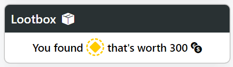

# Afrikan Tähti - University Project

This project presents a browser-based version of the Finnish game "Afrikan Tähti". The objective of the game is to find the diamond and return it to the starting airport. Players can travel between airports in different countries, exchange currency, open loot boxes, and learn about various countries.

## Technical Components

The frontend is implemented using **React Typescript**. The backend consists of a **Python Flask RestAPI**, which connects to a **MariaDB** database.

## Implemented Game Elements

On the left, there is a map from the Leaflet library. All the game's **airports** are marked on it. There are several types of markers:

- **Home** - The starting airport
- **?** - Unexplored airport
- **✓✓** - Visited airport without a loot box
- **Colored diamonds** - Topaz gives 300 coins, Emerald - 600, Ruby - 1000.
- **Bandits** - They take all your money
- **Diamond** - Does not give money. After finding it, you must return to the starting airport to complete the game.

Blue lines indicate available airports.

Green lines show the path traveled.

Gray dashed lines indicate all discovered but not yet visited paths.

## Control Panel

- The Player Info section displays the current amount of money, remaining fuel, the current airport, and the country's flag.

- In the Money to Fuel section, the player can exchange money for fuel.

- Available Airports displays the airports available for travel, as well as the flight cost.

- The Lootbox panel allows opening loot boxes with either money or fuel.

The result will be displayed until the next flight.

## End of the Game

After returning to the starting airport with the diamond, the player receives a victory panel and game statistics.

## Backend

Using **Flask**, an **API** was implemented to handle requests to the database. Game information generation was implemented:
- Obtaining random airports.
- Generating connections between airports.
- Autosaving game session information.

 
 
*P.S. The project was completed in 3 days.